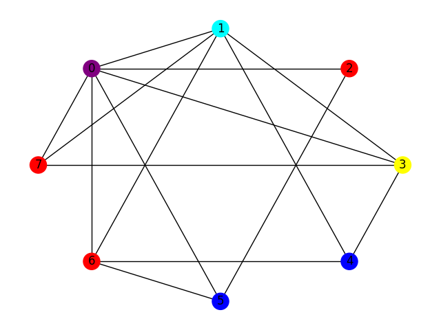

# Proof of Humanity With Graph Coloring Protoype

This script is a basic prototype of proving the coloring of a graph. It is not meant to be production level and is designed for proof of concept.

## The Basics

A UTxO is placed into the contract that holds the hash of a k-coloring of a graph. The user is asked to supply the node labels and colors in the redeemer to reproduce the hash.

For example a user may be prompted to label and color the graph below.


A possible correct answer is this labled and colored graph.



There are many different ways to label and color a graph. Without knowledge about the graph the number of possibilites scales like N!*k! where N is the number of nodes and k is the number of unique colors.

Another option is simply asking for just the coloring with the labels already provided on the graph.


The key here is asking the user to do some work to unlock the UTxO in some interactive way that can be judge for humanity.

## Validation

A graph coloring is correct if the final hash from a Merkle tree built from the labels and colors of a graph is equal to the publicly known coloring hash.

```hs

(giString gStr) == (computeMTree $ constructColoring (nodeList cData) (colorList cData))
```

The problem involves graphs and user interaction but it does reduce down to checking if the Merkle tree representation of two integer lists hash to the correct value.

## Example

Preparing the datum involves creating a graph from a secret string.

```hs
s = "acabbeefface"
g = createGraph s
-- [(5,[4,2,3]),(4,[1,0,5,2]),(3,[1,0,5]),(2,[5,1,4]),(1,[4,3,2]),(0,[4,3])]
c = kColoring g
-- [(0,0),(1,0),(2,2),(3,1),(4,1),(5,0)]
h = computeMTree c
-- de9bcbd8a518bbf7cbe2b691f464d053fdff3545946df6b773c23e94187a4877
```

To unlock this UTxO, the user will provide

```hs
nodes = [5,4,3,2,1,0]
colors = [0,1,1,2,0,0]
construction = constructColoring nodes colors
-- [(0,0),(1,0),(2,2),(3,1),(4,1),(5,0)]
```

The UTxO may be unlocked if and only if

```hs
h == computeMTree construction
```

This is a simple prototype but the idea is there.
